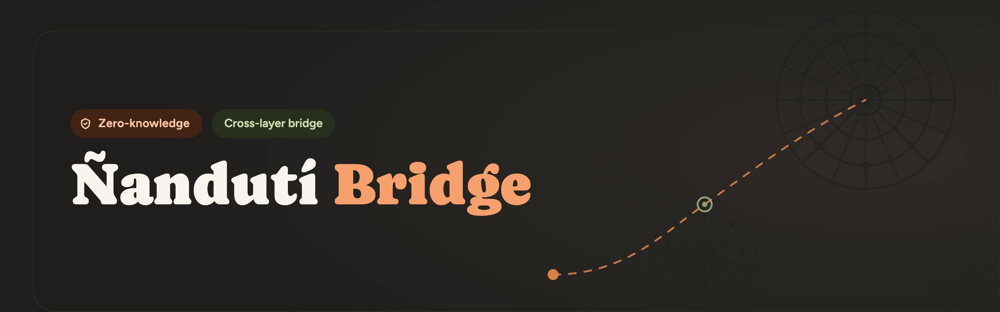

<p align="center">
  
</p>

<h3 align="center">Diseño e implementación de un puente cross-chain con verificación on-chain mediante pruebas de conocimiento cero</h3>

<p align="center">
  <a href="hardhat.config.js"></a>
  <a href="https://hardhat.org"></a>
  <a href="https://docs.ethers.org"></a>
  <a href="https://noir-lang.org"></a>
  <a href="docker-compose.yml"></a>
</p>

---

Puente de tokens entre dos cadenas (L1 ↔ L2) que transfiere **GuaraniToken (GUA)** con el
patrón **lock-and-mint**: el token se bloquea en la cadena de origen y se acuña un equivalente
en la de destino. Tiene dos modos de liberar los fondos en destino, elegidos con
`ENABLE_ZK_PROOF_WAY` en `.env`:

- **Clásico** — un relayer de confianza acuña directamente.
- **ZK** — el relayer adjunta una prueba de conocimiento cero (circuito Noir) y un verificador
  on-chain la valida antes de acuñar. Es el eje de la tesis: reemplazar la confianza en el
  relayer por verificación criptográfica.

Este documento asume el proyecto **dockerizado**, que es como corre hoy en día. Todo el stack
(las dos cadenas, el relayer y el frontend) se orquesta con `docker-compose.yml`.

## Glosario rápido

| Término | Qué significa acá |
|---|---|
| L1 / L2 | La cadena de origen (N1, simulada con Hardhat) y la de destino (N2, simulada con Anvil) del puente |
| Lock-and-mint | Patrón del puente: el token se bloquea en origen y se acuña un equivalente en destino, no se mueve literalmente |
| Relayer | Servicio que escucha eventos en una cadena y dispara la transacción correspondiente en la otra |
| Prover / prueba ZK | Quien genera la prueba de conocimiento cero — acá, que demuestra que una tx de `lock` está incluida en un bloque real, sin revelar todo su contenido |
| Verificador (verifier) | Contrato on-chain que valida una prueba ZK y solo deja pasar la operación si es válida |
| Trustless | Que la seguridad no depende de confiar en un actor (el relayer), sino de la verificación criptográfica |
| RootRegistry | Registro temporal de `transactionsRoot` confiables, mientras no esté la prueba BLS que reemplaza esa confianza (fase 4) |
| ACIR / circuito | Lo que compila Noir a partir del código del circuito (`.nr`); es lo que el prover ejecuta y el verificador valida |

## Contratos por red y modo

| Contrato | Red | Modo | Qué hace |
|---|---|---|---|
| `GuaraniToken` | N1 y N2 | Ambos | ERC-20 (GUA) con mint/burn por roles |
| `Sender` | N1 | Ambos | `lock(to, amount)`: bloquea GUA y emite `Locked(id, from, to, amount)` |
| `Receiver` | N2 | Clásico | `mintRemote(...)`, protegido por `onlyRelayer` + anti-replay |
| `RootRegistry` | N2 | ZK | Registro de `transactionsRoot` confiables (temporal, hasta fase 4) |
| `TxInclusionVerifier` | N2 | ZK | Verificador UltraHonk del circuito MPT, generado por `bb` |
| `ReceiverZK` / `ReceiverZKBound` / `ReceiverZKBoundBLS` | N2 | ZK | `release()`: verifica la prueba (las variantes *Bound* además atan `recipient`/`amount`) y acuña |
| `SignatureVerifierStub` | N2 | ZK (fase 4, stub) | Reemplazo temporal del verificador BLS: siempre devuelve `true` |

---

## Flujo sin ZK (puente clásico)

```
    L1  ·  Hardhat  (chain N1)                   L2  ·  Anvil  (chain N2)
    ┌─────────────────────────┐                  ┌─────────────────────────┐
    │   GuaraniToken (ERC20)  │                  │   GuaraniToken (ERC20)  │
    │     Sender Contract     │                  │    Receiver Contract    │
    └────────────┬────────────┘                  └────────────▲────────────┘
                 │                                            │
                 │ 1. lock(recipientL2, amount)               │ 3. mintRemote(id, to, amount)
                 │    GUA bloqueado en L1                     │    GUA acuñado en L2
                 │    emite evento "Locked"                   │    emite evento "Minted"
                 │                                            │
                 └──────────────┐                             │
                                 ▼                            │
                         ┌───────────────┐
                         │    RELAYER    │────────────────────┘
                         │   2. Escucha  │
                         │    "Locked"   │
                         └───────────────┘
```

El usuario aprueba tokens al contrato `Sender` en N1 y llama `lock(recipientL2, amount)`, que
bloquea el GUA y emite `Locked` con un id único. El relayer escucha ese evento y llama
`mintRemote(id, to, amount)` en el `Receiver` de N2, que acuña el equivalente. La seguridad acá
depende de confiar en que el relayer no acuñe nada que no corresponda a un lock real — no hay
ninguna prueba criptográfica de por medio.

### Requisitos

- Docker y Docker Compose.
- MetaMask (u otra wallet EVM) para operar desde el navegador.
- Node.js solo si vas a correr algún script suelto fuera de Docker (por ejemplo, mintear a otra cuenta).

### Levantar en redes locales

```bash
cp .env.example .env
# dejá ENABLE_ZK_PROOF_WAY=false

docker compose build
docker compose up -d hardhat-n1 anvil-n2

# despliega GuaraniToken + Sender en N1, Receiver clásico en N2, y genera public/config.js
docker compose run --rm deployer bash scripts/docker-deploy.sh

docker compose up -d relayer frontend
```

Frontend en http://localhost:3000. Cada vez que reiniciás `hardhat-n1`/`anvil-n2` los contratos
se pierden — volvé a correr `docker-deploy.sh` antes de seguir usando el puente.

### Usar testnet

El `docker-compose.yml` de hoy tiene el relayer apuntando fijo a los hostnames internos del
stack (`http://hardhat-n1:8545`, `http://anvil-n2:9545`), así que el camino más directo para
testnet es correr el deploy y el relayer **fuera de Docker**, leyendo el `.env`:

```bash
# .env — RPC reales y una cuenta financiada por faucet (nunca la mnemonic de test)
RPC_URL_N1=https://sepolia.infura.io/v3/<TU_KEY>
RPC_URL_N2=<RPC de la L2 testnet que elijas>
PRIVATE_KEY_DEPLOYER=<private key financiada>
PRIVATE_KEY_RELAYER=<private key financiada>
```

`hardhat.config.js` ya tiene las redes `sepolia` y `opSepolia` (leen esas mismas variables):

```bash
npm run deploy:n1:testnet    # Sepolia
npm run deploy:n2:testnet    # L2 testnet, Receiver clásico
npm run config                # regenera public/config.js

npm run relayer
npm run frontend
```

En una testnet real los bloques no son instantáneos ni tienen auto-mining como en local, y
puede haber reorgs — a diferencia de local, acá conviene que el relayer espere unas
confirmaciones antes de dar un `Locked` por válido.

---

## Flujo con ZK (Noir)

```
    ┌─────────┐             ┌─────────────┐                  ┌─────────┐
    │ Usuario │ ──lock()──▶ │ Sender · N1 │ ──emit Locked──▶ │ Relayer │
    └─────────┘             └─────────────┘                  └─────────┘
                   ┌──────────────────────────────────────────────┘
                   │  arma los inputs y corre el circuito
                   ▼
    ┌─────────────────────────────┐
    │ Circuito Noir  ·  off-chain │
    └─────────────────────────────┘
                   │
                   │  proof + public inputs
                   ▼
    ┌─────────────────────────────┐               ┌─────────────────────────┐
    │ ReceiverZK.release()  ·  N2 │ ──verifica──▶ │ TxInclusionVerifier.sol │
    └─────────────────────────────┘               └─────────────────────────┘
                 ┌─────────────────────────────────────────────┘
                 │  si la prueba es válida
                 ▼
    ┌─────────────────────────┐
    │ mint → fondos liberados │
    └─────────────────────────┘
```

El `lock()` en N1 es igual que en el flujo clásico. La diferencia está en N2: en vez de confiar
en que el relayer acuñe correctamente, el relayer genera una prueba de que el `lock` está
incluido en un bloque real (circuito MPT de `noir-merkle`) y se la pasa a
`ReceiverZK.release()`, que la verifica on-chain antes de acuñar. Si la prueba es inválida, o no
corresponde a ese `lock`, la transacción revierte — nadie puede acuñar sin una prueba válida.

### Requisitos

Todo lo del flujo clásico, más:

- `nargo` (toolchain de Noir) y `bb` (Barretenberg CLI) instalados en el host. Se usan una sola
  vez, antes del build de Docker, para generar el verificador Solidity y el ACIR del circuito.
- Versiones que tienen que coincidir entre sí — si no matchean, la prueba no verifica:

  | Componente | Versión |
  |---|---|
  | `nargo` | `1.0.0-beta.22` |
  | `bb` | `5.0.0-nightly.20260522` |
  | `@noir-lang/noir_js` (npm, ya en `package.json`) | `1.0.0-beta.22` |
  | `@aztec/bb.js` (npm, ya en `package.json`) | `5.0.0-nightly.20260522` |

- El repo hermano **`noir-merkle`** (circuito MPT) solo hace falta clonarlo si vas a modificar
  el circuito en sí. El ACIR ya compilado y el verificador Solidity generado a partir de él
  vienen versionados en este repo (`circuits/mpt/`, `contracts/verifiers/TxInclusionVerifier.sol`).

### Levantar en redes locales

```bash
cp .env.example .env
# ENABLE_ZK_PROOF_WAY=true

npm run circuits:mpt          # una sola vez, necesita nargo + bb en el host

docker compose build
docker compose up -d hardhat-n1 anvil-n2

# USE_BLS=1 despliega ReceiverZKBoundBLS (fase 3+4, ata recipient/amount a la prueba).
# Sin esa variable cae a ReceiverZK (fase 1, sin ese binding).
docker compose run --rm -e USE_BLS=1 deployer bash scripts/docker-deploy.sh

docker compose up -d relayer frontend
```

En modo ZK el relayer genera una prueba real por cada `lock` dentro del contenedor: la primera
vez descarga el SRS (unos cientos de MB) y usa bastante RAM, por eso el servicio tiene
`mem_limit: 6g` en el compose.

### Usar testnet

Mismo mecanismo que el flujo clásico (deploy y relayer fuera de Docker, leyendo `.env`), pero
apuntando al deploy ZK de N2:

```bash
npm run deploy:n1:testnet
npx hardhat run scripts/deployN2-zk.js --network opSepolia
npm run config

npm run relayer:zk
npm run frontend
```

La generación de la prueba (SRS + RAM) pesa igual en testnet que en local — lo único que cambia
es el RPC al que apunta. Las mismas consideraciones de confirmaciones/reorgs del flujo clásico
aplican acá.

---

## Estado del proyecto

- **Fases 1-2 — funcionan end-to-end**, con prueba real de cada lock: el relayer arma la MPT
  proof del bloque real (no un fixture), genera la prueba ZK y el verificador la valida
  on-chain antes de acuñar.
- **Fase 3 — binding de `(recipient, amount)`**, implementada, desplegada y probada en vivo: el
  circuito ata esos valores al `lock()` incluido en el bloque, así que `release()` ya no acepta
  una prueba válida de cualquier tx con cualquier destinatario o monto.
- **Fase 4 — pendiente**: falta atar `to == Sender` parseando el RLP de la tx, y reemplazar el
  `RootRegistry` confiable por una firma BLS real (hoy `sigVerifier` es un stub que siempre
  devuelve `true`).

El detalle completo de cada fase, con el trust model exacto de cada una, está en
[`docs/INTEGRACION_ZK.md`](docs/INTEGRACION_ZK.md).

## Consideraciones importantes

- **Reiniciar una cadena borra los contratos.** Un `down`/`up` o `restart` de `hardhat-n1` o
  `anvil-n2` deja las cadenas vacías — hay que volver a correr `docker-deploy.sh`, si no el
  frontend queda apuntando a contratos que ya no existen ("Contract not found").
- **MetaMask cachea el nonce por cuenta y red.** Después de reiniciar una cadena, las
  transacciones fallan aunque haya saldo si no se borran los datos de actividad de esa red
  (ver la sección de MetaMask).
- **El modo del puente se elige antes del deploy.** `ENABLE_ZK_PROOF_WAY` define qué contratos
  se despliegan en N2; cambiarlo después implica re-desplegar y recrear el relayer y el
  frontend, no alcanza con editar el `.env`.
- **`USE_BLS=1` (o `USE_BOUND=1`) no es opcional para el binding real.** Sin esa variable, el
  deploy ZK cae a `ReceiverZK` (fase 1), que no ata `(recipient, amount)` a la prueba.
- **Límite de tamaño de contrato (EIP-170, 24 KB).** El verificador Honk que genera `bb` está
  cerca de ese límite; si el circuito crece, puede dejar de entrar.
- **La fase 4 es honesta sobre lo que falta.** El flujo ZK actual protege contra un probador
  que intente adulterar `(recipient, amount)`, pero todavía confía en que el `transactionsRoot`
  registrado en el `RootRegistry` sea de un bloque real — eso es lo que la firma BLS reemplaza
  cuando esté lista.

## Configurar la billetera en MetaMask

**Redes locales:**

| Campo | L1 (Hardhat) | L2 (Anvil) |
|---|---|---|
| Nombre | Hardhat Local | Anvil Local |
| RPC URL | http://localhost:8545 | http://localhost:9545 |
| Chain ID | 31337 | 1338 |
| Símbolo | ETH | ETH |

Importar la cuenta de prueba (tiene 1.000.000 GUA en N1 tras el deploy):

- **Private key**: `0xac0974bec39a17e36ba4a6b4d238ff944bacb478cbed5efcae784d7bf4f2ff80`
- **Dirección**: `0xf39Fd6e51aad88F6F4ce6aB8827279cffFb92266`

**Redes testnet:** Sepolia ya viene precargada en MetaMask (activarla en Configuración →
Avanzado → "Mostrar redes de test"). La L2 testnet que elijas para N2 (por ejemplo OP Sepolia,
chain ID `11155420`) probablemente haya que agregarla a mano con su RPC público o el de tu
proveedor. Para operar necesitás una cuenta con fondos de faucet en ambas redes, no la cuenta
de prueba de arriba.

**Después de cada reinicio de cadena local**, hay que resetear el nonce que MetaMask cachea:
Configuración → Avanzado → **Borrar datos de la pestaña de actividad**. Si no, las
transacciones fallan con "transacción fallida" aunque haya saldo. Conviene refrescar la página
del frontend con `Cmd+Shift+R` para tomar el `config.js` nuevo.

---

## Estructura del proyecto

```
guarani-bridge/
├── contracts/          # Contratos Solidity (puente + verificadores ZK)
├── circuits/           # ACIR de los circuitos Noir
├── scripts/            # Deploy y utilidades
├── test/               # Tests
├── relayer/            # Servicio relayer (clásico y ZK)
├── public/              # Frontend web
├── utils/               # Utilidades compartidas
└── docs/                # Diseño ZK por fases (INTEGRACION_ZK.md) y guía de arranque (RUN.md)
```

## Testing

Necesitan N1 y N2 corriendo (Docker o `npm run node:n1`/`node:n2`) con los contratos ya
desplegados — no son tests unitarios en una chain efímera, verifican el deploy real.

```bash
npm test                   # Bridge + Infrastructure + NetworkDiagnostic + ZK
npm run test:bridge        # lock/mint/replay
npm run test:infra         # contra deploy-N1.json/deploy-N2*.json reales
npm run test:release       # ReceiverZK, no necesita N1/N2 corriendo
```
